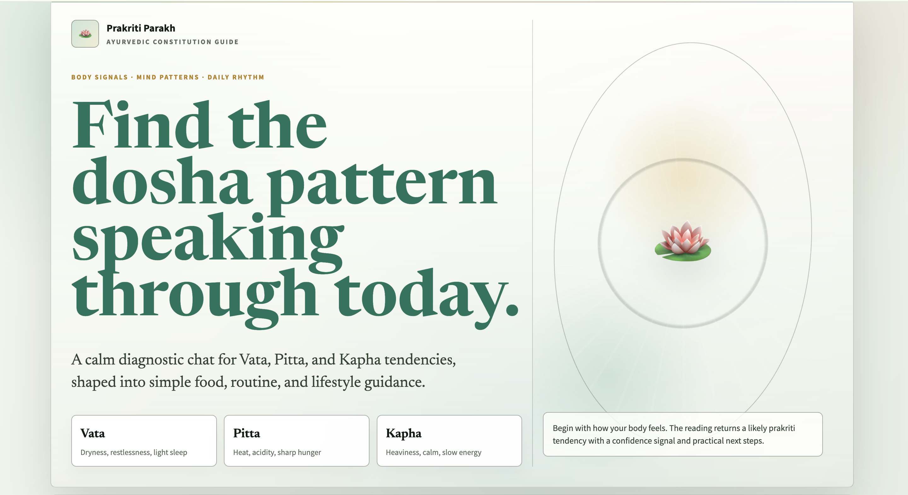
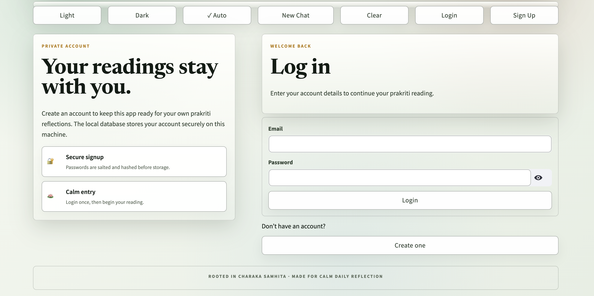
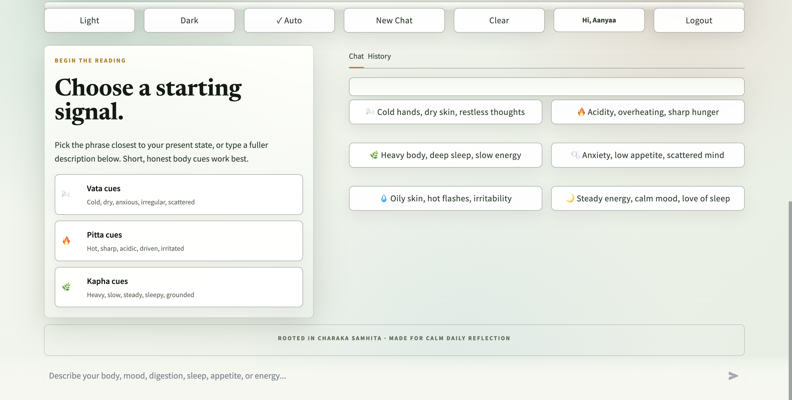
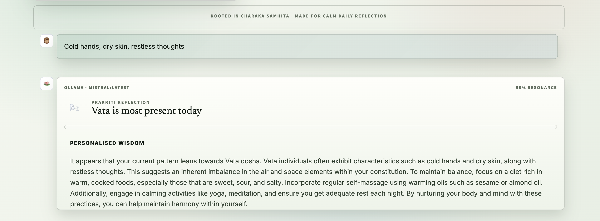

# 🪷 Prakriti Parakh

A serene Ayurvedic reflection app to explore Vata, Pitta, and Kapha patterns through a calm guided chat.

## 🌐 Live Demo

https://prakriti-parakh-chatbot-6aje3hwk4afdzo5jzwdvft.streamlit.app/

## ✨ Features

- 🔐 Login and signup
- 💬 Personal prakriti chat experience
- 🧾 Separate chat history for every user
- 🌿 Vata, Pitta, and Kapha-based reflections
- 🌗 Light / Dark / Auto theme
- 🗂 SQLite locally, Postgres in deployment
- ⚡ Graceful fallback when model services are unavailable
- 🎨 Clean, calming UI

## 🛠 Tech Stack

### Frontend

- Streamlit
- CSS

### Backend

- Python
- Requests

### Database

- SQLite
- PostgreSQL
- Psycopg

### Deployment

- Streamlit Community Cloud
- Neon Postgres

## 📸 Screenshots

### Home



### Login



### Chat



### Response



## 🚀 Run Locally

### Clone the repo

```bash
git clone https://github.com/anushka0917/prakriti-parakh-chatbot.git
```

### Go inside the folder

```bash
cd prakriti-parakh-chatbot
```

### Install dependencies

```bash
pip install -r requirements.txt
```

### Run the app

```bash
streamlit run app.py
```

## 👩‍💻 Author

**Anushka Verma Namdeo**  
B.Tech Computer Science Engineering

⭐ If you like this project, give it a star!
